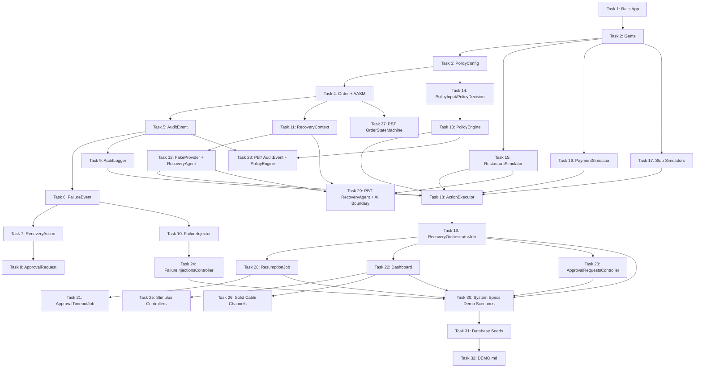

# Implementation Plan: Safe Order Recovery

## Overview

This plan implements the Safe Order Recovery pipeline for the OrderOps platform — a structured, auditable system that detects order failures, diagnoses them via an AI agent, evaluates recovery options through a deterministic policy engine, obtains human approval when required, and executes the approved action. All within Rails 8.1, PostgreSQL, Hotwire/Turbo, Solid Queue, and Solid Cable.

The guiding constraint throughout every task:

> **AI reasons and recommends. PolicyEngine decides. A human approves when required. ActionExecutor acts only on approved decisions.**

---

## Task Dependency Graph

```
Phase 1 — Rails Scaffold
  Task 1 ──► Task 2 ──► Task 3

Phase 2 — Core Domain Models
  Task 3 ──► Task 4
  Task 4 ──► Task 5 ──► Task 6 ──► Task 7 ──► Task 8

Phase 3 — Core Services
  Task 5 ──► Task 9 ──► Task 4 (connects callbacks)
  Task 6 ──► Task 10
  Task 4 ──► Task 11

Phase 4 — AI and Policy
  Task 11 ──► Task 12
  Task 3  ──► Task 14 ──► Task 13

Phase 5 — Simulators
  Task 2  ──► Task 15
  Task 2  ──► Task 16
  Task 2  ──► Task 17

Phase 6 — Recovery Pipeline
  Task 9, 12, 13, 15, 16, 17 ──► Task 18
  Task 18 ──► Task 19
  Task 19 ──► Task 20
  Task 20 ──► Task 21

Phase 7 — Controllers and Dashboard
  Task 19 ──► Task 22
  Task 19 ──► Task 23
  Task 10 ──► Task 24
  Task 22 ──► Task 25
  Task 22 ──► Task 26

Phase 8 — Property-Based Tests and System Specs
  Task 4  ──► Task 27
  Task 5, 13 ──► Task 28
  Task 11, 12, 15 ──► Task 29
  Task 19, 20, 22, 23, 24 ──► Task 30

Phase 9 — Demo Polish
  Task 30 ──► Task 31
  Task 31 ──► Task 32
```



```json
{
  "waves": [
    { "id": 0, "tasks": ["1.1"] },
    { "id": 1, "tasks": ["1.2", "2.1"] },
    { "id": 2, "tasks": ["2.2", "2.3"] },
    { "id": 3, "tasks": ["3.1"] },
    { "id": 4, "tasks": ["3.2"] },
    { "id": 5, "tasks": ["3.3", "3.4"] },
    { "id": 6, "tasks": ["4.1"] },
    { "id": 7, "tasks": ["4.2"] },
    { "id": 8, "tasks": ["4.3"] },
    { "id": 9, "tasks": ["4.4", "5.1"] },
    { "id": 10, "tasks": ["5.2"] },
    { "id": 11, "tasks": ["5.3", "5.4", "6.1"] },
    { "id": 12, "tasks": ["6.2", "7.1"] },
    { "id": 13, "tasks": ["6.3", "7.2", "8.1"] },
    { "id": 14, "tasks": ["7.3", "8.2"] },
    { "id": 15, "tasks": ["8.3", "9.1"] },
    { "id": 16, "tasks": ["9.2"] },
    { "id": 17, "tasks": ["9.3", "10.1", "11.1", "14.1", "14.2", "15.1", "16.1", "17.1"] },
    { "id": 18, "tasks": ["10.2", "11.2", "14.3", "15.2", "15.3", "16.2", "17.2"] },
    { "id": 19, "tasks": ["12.1", "13.1"] },
    { "id": 20, "tasks": ["12.2"] },
    { "id": 21, "tasks": ["12.3", "12.4", "13.2"] },
    { "id": 22, "tasks": ["18.1"] },
    { "id": 23, "tasks": ["18.2"] },
    { "id": 24, "tasks": ["19.1"] },
    { "id": 25, "tasks": ["19.2", "20.1"] },
    { "id": 26, "tasks": ["20.2", "21.1"] },
    { "id": 27, "tasks": ["21.2", "22.1"] },
    { "id": 28, "tasks": ["22.2"] },
    { "id": 29, "tasks": ["22.3", "22.4", "22.5", "23.1", "24.1"] },
    { "id": 30, "tasks": ["22.6", "23.2", "24.2", "24.3", "25.1", "25.2", "25.3", "26.1", "26.2", "26.3", "26.4"] },
    { "id": 31, "tasks": ["26.5", "27.1", "28.1", "28.2", "29.1"] },
    { "id": 32, "tasks": ["29.2", "29.3", "29.4", "29.5", "29.6"] },
    { "id": 33, "tasks": ["30.1", "30.2"] },
    { "id": 34, "tasks": ["31.1", "31.2"] },
    { "id": 35, "tasks": ["31.3"] },
    { "id": 36, "tasks": ["32.1"] }
  ]
}
```

---

## Tasks

- [ ] 1. Create Rails 8.1 application scaffold
  - [ ] 1.1 Generate new Rails 8.1 application with PostgreSQL adapter
    - Run `rails new orderops --database=postgresql --asset-pipeline=propshaft` (or equivalent for 8.1)
    - Confirm `config/database.yml` is configured for a local PostgreSQL instance
    - Run `rails db:create` to verify database connectivity
    - _Requirements: NFR-01 (testability baseline), NFR-02_

  - [ ]* 1.2 Verify application boots cleanly
    - Confirm `rails runner 'puts Rails.version'` outputs `8.1.x` without errors
    - _Requirements: NFR-01_

- [ ] 2. Add and configure required gems
  - [ ] 2.1 Add runtime gems to Gemfile
    - Add `aasm` (AASM state machine)
    - Add `json-schema` (AI response schema validation)
    - Add `solid_queue` and `solid_cable` (if not already included in Rails 8.1 defaults)
    - Run `bundle install`
    - _Requirements: REQ-01 (AASM), REQ-03 (json-schema), REQ-05 (Solid Queue), REQ-09 (Solid Cable)_

  - [ ] 2.2 Add test/development gems to Gemfile
    - Add `rspec-rails`, `factory_bot_rails`, `rantly`, `capybara`, `selenium-webdriver`
    - Run `rails generate rspec:install`
    - Configure `spec/rails_helper.rb` to include FactoryBot syntax methods and DatabaseCleaner (if used)
    - _Requirements: NFR-01_

  - [ ]* 2.3 Write smoke tests confirming gem availability
    - `require 'aasm'` succeeds in a spec
    - `require 'json-schema'` succeeds in a spec
    - `require 'rantly'` succeeds in a spec
    - _Requirements: NFR-01_

- [ ] 3. Create PolicyConfig YAML and loader service
  - [ ] 3.1 Create `config/policy_config.yml` with all required keys
    - Include: `version`, `max_reroute_attempts` (3), `human_approval_refund_threshold_cents` (5000), `human_approval_reroute_threshold` (2), `human_approval_confidence_threshold` (0.5), `approval_timeout_seconds` (120), AI timeout (15)
    - Include per-action configuration block with `requires_approval` and `eligible_failure_types` for all 8 action types
    - Include `sla_budgets` section
    - _Requirements: REQ-04 AC10, NFR-02, NFR-03, REQ-10 AC7_

  - [ ] 3.2 Implement `app/services/policy_config.rb` loader
    - `PolicyConfig.load!` reads `config/policy_config.yml`
    - Raises `PolicyConfig::MissingConfigError` if the file does not exist
    - Raises `PolicyConfig::InvalidConfigError` if required keys are absent
    - Exposes typed accessors for every threshold value (no raw hash access in application code)
    - Stores `version` string
    - _Requirements: REQ-04 AC10, REQ-10 AC7, NFR-02, NFR-03_

  - [ ] 3.3 Create `config/initializers/policy_config.rb`
    - Calls `PolicyConfig.load!` at application boot
    - Stores result in `Rails.application.config.policy_config`
    - _Requirements: REQ-04 AC10, REQ-10 AC7_

  - [ ]* 3.4 Write RSpec unit tests for PolicyConfig
    - Loading a valid YAML returns a PolicyConfig with correct typed values
    - Missing file raises `MissingConfigError`
    - File with missing required key raises `InvalidConfigError`
    - All numeric thresholds are accessible via named methods (no raw hash access)
    - _Requirements: REQ-04 AC10, REQ-10 AC7_

  **Kiro University lesson:** This task demonstrates spec-driven safety requirements — the application refuses to boot when critical configuration is absent, a pattern enforced through the requirements document before a line of code was written.

- [ ] 4. Create Order model with AASM state machine
  - [ ] 4.1 Generate Order migration
    - Create `orders` table with all columns from the design: `external_id` (unique), `customer_id`, `restaurant_id` (nullable), `cuisine_type`, `total_cents` (default 0), `items` (jsonb), `delivery_address` (jsonb), `state` (string, default 'pending'), `timestamps`
    - Add index on `state`
    - Run `rails db:migrate`
    - _Requirements: REQ-01, design data model_

  - [ ] 4.2 Create `app/models/order.rb` with validations and associations
    - Validate presence of `external_id`, `customer_id`, `cuisine_type`
    - Validate `total_cents >= 0`
    - Validate `state` is in the allowed set
    - `has_many :failure_events`, `has_many :recovery_actions`, `has_many :approval_requests`, `has_many :audit_events`
    - `scope :active, -> { where.not(state: %w[delivered cancelled failed recovered]) }`
    - _Requirements: REQ-01 AC1_

  - [ ] 4.3 Create `app/models/concerns/order_state_machine.rb`
    - Define all 12 states: `pending`, `assigned`, `accepted`, `preparing`, `ready_for_pickup`, `in_delivery`, `delivered`, `failed`, `cancelled`, `recovered`, `pending_approval`, `recovering`
    - Define all events and transitions exactly as specified in REQ-01 AC2: `assign`, `accept`, `begin_prep`, `ready`, `pick_up`, `deliver`, `reroute`, `fail`, `request_approval`, `begin_recovery`, `recover`, `cancel`
    - Set `aasm column: :state, whiny_transitions: true`
    - Add `before_all_transitions :acquire_row_lock`
    - Add `after_all_transitions :record_state_change_audit_event` (stub method body — `AuditLogger` wired in Task 9)
    - `acquire_row_lock` calls `lock!` to obtain a PostgreSQL row-level lock
    - _Requirements: REQ-01 AC1–AC7_

  - [ ]* 4.4 Write RSpec unit tests for OrderStateMachine
    - All 12 states are defined
    - Every transition in the allowed table succeeds from the correct source state
    - Every invalid `(from, to)` pair raises `AASM::InvalidTransition`
    - `lock!` is called on every transition (`expect(order).to receive(:lock!)`)
    - `DELIVERED`, `CANCELLED`, `RECOVERED` have no outbound transitions (terminal)
    - `FAILED` has exactly three outbound events: `request_approval`, `recover`, `cancel`
    - Concurrent transition test: two threads attempt the same transition on the same order; the final state is consistent (one succeeds, one raises)
    - _Requirements: REQ-01 AC1–AC7_

  **Kiro University lesson:** The state machine transition table is specified completely in `requirements.md` before implementation begins — the tests written here are direct translations of REQ-01 AC2, demonstrating how spec-driven development reduces ambiguity at the model layer.

- [ ] 5. Create AuditEvent model with append-only enforcement
  - [ ] 5.1 Generate AuditEvent migration
    - Create `audit_events` table: `order_id` (bigint, not null, indexed), `event_type` (string, not null, indexed), `actor_type` (string, not null), `actor_id` (string), `from_state` (string), `to_state` (string), `payload` (jsonb, default {}), `policy_version` (string), `ai_model` (string), `injected` (boolean, not null, default false), `occurred_at` (datetime, precision 6, not null, indexed)
    - No `updated_at` column — append-only
    - Add composite index on `[order_id, occurred_at]`
    - _Requirements: REQ-08 AC1, AC3, AC6_

  - [ ] 5.2 Create `app/models/audit_event.rb`
    - `belongs_to :order`
    - Validate `event_type` is in the exhaustive enum set from REQ-08 AC1
    - Validate `actor_type` is one of `system`, `ai`, `human`, `simulator`
    - Validate `injected` is not nil
    - `before_update` callback raises `FrozenRecord::Error` (or a custom `AuditEvent::ImmutableRecordError`)
    - `before_destroy` callback raises `AuditEvent::ImmutableRecordError`
    - Default scope: `order(:occurred_at)`
    - _Requirements: REQ-08 AC1–AC3, AC6, AC8_

  - [ ] 5.3 Add `audit_events` association helper to `Order`
    - `Order#audit_trail` returns `audit_events.order(occurred_at: :asc)`
    - _Requirements: REQ-01 AC6, REQ-08 AC6_

  - [ ]* 5.4 Write RSpec unit tests for AuditEvent
    - Valid record with all required fields saves successfully
    - `before_update` raises `ImmutableRecordError`
    - `before_destroy` raises `ImmutableRecordError`
    - Records are returned ordered by `occurred_at` ascending
    - `injected` cannot be nil (validation failure)
    - `event_type` must be from the allowed set
    - _Requirements: REQ-08 AC1–AC3, AC8_

- [ ] 6. Create FailureEvent model
  - [ ] 6.1 Generate FailureEvent migration
    - Create `failure_events` table: `order_id` (bigint, not null, indexed), `failure_type` (string, not null), `description` (text, not null), `injected` (boolean, not null, default false), `occurred_at` (datetime, precision 6, not null)
    - Add composite index on `[order_id, occurred_at]`
    - _Requirements: REQ-02 AC1, AC2_

  - [ ] 6.2 Create `app/models/failure_event.rb`
    - `belongs_to :order`
    - `has_one :recovery_action`
    - Define `failure_type` enum with all 9 values (stored as string): `restaurant_rejection`, `restaurant_unavailable`, `inventory_failure`, `kitchen_delay`, `kitchen_failure`, `delivery_delay`, `delivery_failure`, `payment_failure`, `external_service_failure`
    - Validate `failure_type` in enum, `injected` not nil, `occurred_at` present, `description` present
    - _Requirements: REQ-02 AC1, AC2_

  - [ ]* 6.3 Write RSpec unit tests for FailureEvent
    - All 9 failure types save successfully
    - Invalid `failure_type` raises validation error
    - `injected` cannot be nil
    - `occurred_at` is required
    - _Requirements: REQ-02 AC1, AC2_

- [ ] 7. Create RecoveryAction model
  - [ ] 7.1 Generate RecoveryAction migration
    - Create `recovery_actions` table: `order_id` (bigint, not null, indexed), `failure_event_id` (bigint, not null, indexed), `action_type` (string, not null), `status` (string, not null, default 'proposed', indexed), `ai_confidence` (decimal, precision 4 scale 3), `ai_reasoning` (text), `estimated_customer_impact` (string), `parameters` (jsonb, default {}), `executed_at` (datetime, precision 6), `timestamps`
    - Add composite indexes on `[order_id, status]` and `[order_id, action_type]`
    - _Requirements: REQ-03 AC2, design data model_

  - [ ] 7.2 Create `app/models/recovery_action.rb`
    - `belongs_to :order`
    - `belongs_to :failure_event`
    - `has_one :approval_request`
    - Define `action_type` enum: `reroute_restaurant`, `partial_refund`, `full_refund`, `issue_voucher`, `escalate_to_human`, `cancel_order`, `retry_delivery`, `contact_customer`
    - Define `status` enum: `proposed`, `approved`, `rejected`, `executing`, `executed`, `failed`
    - Validate `action_type` in enum, `status` in enum, `ai_confidence` between 0.0 and 1.0 (if present)
    - _Requirements: REQ-03 AC2, AC3, REQ-06 AC7_

  - [ ]* 7.3 Write RSpec unit tests for RecoveryAction
    - All 8 action types save successfully
    - All 6 statuses save successfully
    - `ai_confidence` outside 0.0–1.0 fails validation
    - `status` transitions via enum helpers work correctly
    - _Requirements: REQ-03 AC2, REQ-06 AC7_

- [ ] 8. Create ApprovalRequest model with partial unique index
  - [ ] 8.1 Generate ApprovalRequest migration
    - Create `approval_requests` table: `order_id` (bigint, not null, indexed), `recovery_action_id` (bigint, not null, unique index), `status` (string, not null, default 'pending', indexed), `operator_id` (string), `operator_note` (text), `requested_at` (datetime, precision 6, not null), `decided_at` (datetime, precision 6), `timestamps`
    - Add partial unique index: `add_index :approval_requests, :order_id, unique: true, where: "status = 'pending'", name: 'idx_approval_requests_one_pending_per_order'`
    - _Requirements: REQ-07 AC1, AC5_

  - [ ] 8.2 Create `app/models/approval_request.rb`
    - `belongs_to :order`
    - `belongs_to :recovery_action`
    - Define `status` enum: `pending`, `approved`, `rejected`
    - Validate `requested_at` present
    - Validate `decided_at` present when status is `approved` or `rejected`
    - _Requirements: REQ-07 AC1, AC5_

  - [ ]* 8.3 Write RSpec unit tests for ApprovalRequest
    - Creating a second `pending` ApprovalRequest for the same order raises `ActiveRecord::RecordNotUnique`
    - Creating a second `approved` ApprovalRequest for the same order succeeds (partial index only applies to `pending`)
    - `decided_at` validation fires on approval/rejection
    - _Requirements: REQ-07 AC5_

  **Kiro University lesson:** The partial unique index in this task comes directly from the design document, which itself was derived from the correctness property in `requirements.md` ("At most one ApprovalRequest per Order has status: pending at any point in time"). This is the spec-to-database-constraint pipeline working as intended.

- [ ] 9. Implement AuditLogger service and connect OrderStateMachine callbacks
  - [ ] 9.1 Create `app/services/audit_logger.rb`
    - `AuditLogger.record(order:, event_type:, actor_type:, **opts)` creates and persists an `AuditEvent`
    - Populates `occurred_at: Time.current` if not supplied
    - After creation, broadcasts a Turbo Stream `append` to `"order_#{order.id}"` targeting `"audit_timeline_#{order.id}"` using the `audit_events/_audit_event` partial
    - Returns the created `AuditEvent`
    - _Requirements: REQ-08 AC1–AC6, REQ-09 AC7_

  - [ ] 9.2 Connect `record_state_change_audit_event` in `OrderStateMachine`
    - Replace the stub body from Task 4.3 with a real call to `AuditLogger.record(order: self, event_type: :order_state_changed, actor_type: :system, from_state: aasm.from_state, to_state: aasm.to_state)`
    - _Requirements: REQ-01 AC3, REQ-08 AC2_

  - [ ]* 9.3 Write RSpec unit tests for AuditLogger
    - `AuditLogger.record` creates an `AuditEvent` with all supplied fields
    - `occurred_at` defaults to `Time.current` when not supplied
    - Calling `record` for a state change produces an `AuditEvent` with `event_type: "order_state_changed"` and correct `from_state` / `to_state`
    - `AuditEvent` count for an order increases by 1 per `record` call
    - Turbo Stream broadcast is triggered (stub `ActionCable.server.broadcast` and assert it's called)
    - _Requirements: REQ-01 AC3, REQ-08 AC1–AC6_

- [ ] 10. Implement FailureInjector service
  - [ ] 10.1 Create `app/services/failure_injector.rb`
    - `FailureInjector.inject(order_id:, failure_type:, description:)` — class method
    - Loads `Order.find(order_id)`
    - Raises `FailureInjector::TerminalOrderError` if order state is `delivered`, `cancelled`, or `recovered`
    - Creates `FailureEvent` with `injected: true` and `occurred_at: Time.current`
    - Calls `AuditLogger.record(order:, event_type: :failure_detected, actor_type: :system, injected: true, payload: { failure_type:, description: })`
    - Enqueues `RecoveryOrchestratorJob.perform_later(failure_event_id: failure_event.id)`
    - Returns the created `FailureEvent`
    - _Requirements: REQ-02 AC3, AC4, AC5, AC6_

  - [ ]* 10.2 Write RSpec unit tests for FailureInjector
    - Creates `FailureEvent` with `injected: true` for an order in `PREPARING` state
    - Raises `TerminalOrderError` for all terminal states: `delivered`, `cancelled`, `recovered`
    - Does NOT raise for `failed` state (failed is not terminal for injection purposes per REQ-02 AC5: "terminal state" per the requirements is `DELIVERED`, `CANCELLED`, `RECOVERED` — `FAILED` is recoverable)
    - Enqueues `RecoveryOrchestratorJob` after creating the FailureEvent
    - `AuditEvent` with `event_type: "failure_detected"` and `injected: true` is created
    - No `FailureEvent` is created when `TerminalOrderError` is raised (assert count unchanged)
    - _Requirements: REQ-02 AC3–AC6_

- [ ] 11. Implement RecoveryContext read-only value object
  - [ ] 11.1 Create `app/services/recovery_context.rb`
    - `RecoveryContext.build(order, failure_event)` — factory class method
    - Exposes read-only accessors: `order_state`, `order_id`, `cuisine_type`, `total_cents`, `failure_type`, `failure_description`, `audit_history` (array of plain hashes), `permitted_action_types` (from `PolicyConfig`), `available_restaurants`
    - `audit_history` is built from `AuditEvent` records for the order, mapped to plain hashes (no ActiveRecord objects)
    - `available_restaurants` calls `RestaurantSimulator#available_for(cuisine_type:)` (injected as dependency, defaulting to `Rails.application.config.simulators.restaurant`)
    - Implements `method_missing` to intercept all undefined methods and raise `NotImplementedError` with message: `"#{method_name} is prohibited on RecoveryContext (category: <category>)"`
    - Categories to detect and name: Order record mutation, RecoveryAction mutation, AuditEvent mutation, simulator mutations, ActionExecutor calls
    - _Requirements: REQ-03 AC1, REQ-11 AC1a, AC1b, AC2, AC5_

  - [ ]* 11.2 Write RSpec unit tests for RecoveryContext
    - `order_state` returns the order's current state string
    - `audit_history` returns plain hashes (not ActiveRecord objects)
    - `permitted_action_types` returns values from PolicyConfig
    - All read accessors return the expected values
    - Calling `:save` raises `NotImplementedError` with message including "save"
    - Calling `:update!` raises `NotImplementedError`
    - Calling `:refund` raises `NotImplementedError`
    - Calling `:execute_action` raises `NotImplementedError`
    - Shared example group `"AI advisory boundary"` passes (see Task 29 for definition — reference the shared example structure here even if the full file is written in Task 29)
    - _Requirements: REQ-03 AC1, REQ-11 AC1a–AC2_

  **Kiro University lesson:** The AI advisory boundary is enforced at the object boundary level — `RecoveryContext` is a value object that physically cannot expose write methods, making it impossible for the AI agent to mutate state regardless of what the LLM generates. This is the spec requirement REQ-11 translated directly into a Ruby interface.

- [ ] 12. Implement FakeProvider and RecoveryAgent with schema validation and fallback
  - [ ] 12.1 Create `app/services/providers/fake_provider.rb`
    - Define `Proposal` struct: `action_type`, `confidence`, `reasoning`, `estimated_customer_impact`
    - Define `RESPONSES` constant (frozen hash) keyed by all 9 `failure_type` symbols, each mapping to a ranked array of `Proposal` structs
    - Scenario 1: `kitchen_failure` → `[reroute_restaurant @ 0.85, cancel_order @ 0.40]`
    - Scenario 2: `delivery_failure` → `[full_refund @ 0.90, retry_delivery @ 0.55]`
    - All other failure types must have at least one proposal
    - `diagnose(context:)` method — looks up `RESPONSES[context.failure_type.to_sym]`; raises `FakeProvider::UnknownFailureTypeError` if failure type is not in the map
    - _Requirements: REQ-03 AC9, design FakeProvider section_

  - [ ] 12.2 Create `app/services/recovery_agent.rb`
    - Module-level `provider=` and `provider` accessors (set in initializer)
    - `RecoveryAgent.diagnose(context:)` — delegates to `provider.diagnose(context:)`
    - Wraps provider call in a `Timeout.timeout(policy_config.ai_timeout_seconds)` block
    - Validates the array of proposals against the JSON schema (using `json-schema` gem); each proposal must have `action_type` in the allowed 8 values, `confidence` 0.0–1.0, `reasoning` string, `estimated_customer_impact` in `low/medium/high`
    - On `Timeout::Error` or `StandardError` from provider: applies fallback (returns single Proposal from fallback table with `confidence: 0.0, reasoning: "deterministic_fallback"`)
    - On schema validation failure: applies fallback
    - Does not record AuditEvents — caller (`RecoveryOrchestrator`) is responsible
    - _Requirements: REQ-03 AC1–AC9_

  - [ ] 12.3 Create `config/initializers/recovery_agent.rb`
    - Sets `RecoveryAgent.provider` based on `ENV.fetch("RECOVERY_AGENT_PROVIDER", "fake")`
    - `"fake"` → `Providers::FakeProvider.new`
    - _Requirements: REQ-03 AC9, design Provider Configuration section_

  - [ ]* 12.4 Write RSpec unit tests for FakeProvider and RecoveryAgent
    - `FakeProvider#diagnose` returns deterministic proposals for `kitchen_failure`
    - `FakeProvider#diagnose` returns deterministic proposals for `delivery_failure`
    - All 9 failure types have entries in `RESPONSES` (no `UnknownFailureTypeError` for any valid type)
    - Calling with the same `failure_type` 10 times returns identical arrays
    - `RecoveryAgent.diagnose` passes proposals through schema validation
    - `RecoveryAgent.diagnose` applies fallback when provider raises `StandardError`
    - `RecoveryAgent.diagnose` applies fallback on timeout
    - `RecoveryAgent.diagnose` applies fallback when schema validation fails (inject malformed proposal)
    - Fallback proposal has `confidence: 0.0` and `reasoning: "deterministic_fallback"`
    - _Requirements: REQ-03 AC2–AC9_

  **Kiro University lesson:** The `FakeProvider` is the "F" in the AI advisory pattern — it makes the AI boundary testable without a real LLM. The determinism requirement (REQ-03 AC9) is enforced by the frozen `RESPONSES` constant, ensuring reproducible demo and test runs, which is a core spec-driven design decision.

- [ ] 13. Implement PolicyEngine as pure function
  - [ ] 13.1 Create `app/services/policy_engine.rb`
    - Define as a Ruby `Module`, not a class. Apply `freeze` after definition.
    - Single public method: `PolicyEngine.evaluate(input:) → PolicyDecision`
    - Evaluation order (from design): G1 → G2 → G3 → G4 → G5 → G6 → configurable policy → human approval triggers
    - **G1**: `input.refund_amount.nil? || input.refund_amount <= input.order_snapshot[:total_cents]` — else DENIED with `guardrail_violated: :G1`
    - **G2**: `FULL_REFUND` + no `partial_delivery_confirmed` AuditEvent in history — else DENIED `:G2`
    - **G3**: count of `REROUTE_RESTAURANT` executed RecoveryActions < `policy_config.max_reroute_attempts` — else DENIED `:G3`
    - **G4**: order state not in terminal set (`delivered`, `cancelled`, `failed`, `recovered`) — else DENIED `:G4`
    - **G5**: `CANCEL_ORDER` requires `approved` ApprovalRequest present in audit history OR `policy_config` explicit permission — else DENIED `:G5`
    - **G6**: no `refund_executed` AuditEvent in history when action is `PARTIAL_REFUND` or `FULL_REFUND` — else DENIED `:G6`
    - Human approval triggers (5 conditions from REQ-04 AC5): threshold check, cancel in late state, reroute count ≥ threshold, low confidence, explicit `requires_approval: true` in PolicyConfig
    - On any internal exception: rescue and return `PolicyDecision.new(status: :denied, reason: "internal_policy_error", requires_human_approval: false, guardrail_violated: nil)`
    - Zero ActiveRecord calls, zero file reads, zero HTTP calls during `evaluate`
    - _Requirements: REQ-04 AC1–AC10, NFR-03_

  - [ ]* 13.2 Write RSpec unit tests for PolicyEngine
    - Each guardrail rule (G1–G6) independently: construct `PolicyInput` that violates only that rule; assert `DENIED` with correct `guardrail_violated`
    - G4 with each terminal state: `delivered`, `cancelled`, `failed`, `recovered`
    - Human approval trigger: `total_cents: 7500 > threshold 5000` → `requires_human_approval: true`
    - Human approval trigger: `total_cents: 4999 ≤ threshold 5000` → `requires_human_approval: false` (assuming other conditions clear)
    - Human approval trigger: `confidence: 0.49 < threshold 0.5` → `requires_human_approval: true`
    - Human approval trigger: `confidence: 0.5 ≥ threshold 0.5` → `requires_human_approval: false`
    - Human approval trigger: `cancel_order` in `PREPARING` state → `requires_human_approval: true`
    - `PolicyEngine.evaluate` always returns a `PolicyDecision` — never raises — even with nil/garbage inputs
    - Same `PolicyInput` called twice returns identical `PolicyDecision`
    - Branch coverage: 100% target across all 6 guardrails and 5 human-approval triggers
    - _Requirements: REQ-04 AC1–AC10, NFR-01_

  **Kiro University lesson:** The PolicyEngine is a pure function because the design document mandates it (REQ-04 AC7, AC8). No database access during evaluation means it can be unit-tested completely in isolation — every branch is reachable without fixtures. The spec requirement drives the architecture.

- [ ] 14. Implement PolicyInput and PolicyDecision value objects
  - [ ] 14.1 Create `app/services/policy_input.rb` using `Data.define`
    - Fields: `action_type` (Symbol), `order_snapshot` (Hash), `audit_history` (Array), `policy_config` (PolicyConfig), `ai_confidence` (Float)
    - Helper method `refund_amount` — extracts from `order_snapshot[:parameters][:amount_cents]` or returns `nil`
    - Helper method `reroute_count` — counts executed `reroute_restaurant` entries in `audit_history`
    - _Requirements: REQ-04, design PolicyInput section_

  - [ ] 14.2 Create `app/services/policy_decision.rb` using `Data.define`
    - Fields: `status` (Symbol: `:approved` / `:denied`), `requires_human_approval` (Boolean), `reason` (String), `guardrail_violated` (Symbol, nilable)
    - _Requirements: REQ-04 AC3, AC4, AC6, design PolicyDecision section_

  - [ ]* 14.3 Write RSpec unit tests for PolicyInput and PolicyDecision
    - `PolicyInput` with valid fields initializes without error
    - `reroute_count` returns correct count from audit history
    - `PolicyDecision` with `status: :denied` and `guardrail_violated: :G1` initializes correctly
    - `PolicyDecision` with `status: :approved` and `requires_human_approval: false` initializes correctly
    - _Requirements: REQ-04_

- [ ] 15. Implement RestaurantSimulator
  - [ ] 15.1 Create `app/simulators/restaurant_simulator.rb`
    - Define `Restaurant` struct: `id`, `name`, `cuisine_types` (array), `acceptance_rate` (Float), `latency_ms` (Integer), `available` (Boolean)
    - `available_for(cuisine_type:, excluding_restaurant_ids: [])` — returns restaurants matching cuisine_type, `available: true`, not in exclusion list, ordered by acceptance_rate descending
    - `mark_unavailable(restaurant_id:)` — sets `available: false` for the restaurant
    - `simulate_acceptance(restaurant_id:)` — returns `true`/`false` probabilistically based on `acceptance_rate`
    - `seed_restaurants(count:)` — creates `count` in-memory Restaurant objects with varied cuisine types, acceptance rates, and latencies
    - _Requirements: REQ-06 AC5, AC9_

  - [ ] 15.2 Create `config/initializers/simulators.rb`
    - Instantiates all simulators and stores them in `Rails.application.config.simulators`
    - Calls `restaurant_simulator.seed_restaurants(count: 10)` on boot
    - _Requirements: REQ-06 AC5_

  - [ ]* 15.3 Write RSpec unit tests for RestaurantSimulator
    - `available_for` returns only restaurants matching the cuisine type
    - `available_for` excludes restaurants in the exclusion list
    - `available_for` excludes restaurants with `available: false`
    - `mark_unavailable` causes restaurant to be excluded from `available_for` results
    - `simulate_acceptance` with `acceptance_rate: 1.0` always returns `true`
    - `simulate_acceptance` with `acceptance_rate: 0.0` always returns `false`
    - _Requirements: REQ-06 AC5, AC9_

- [ ] 16. Implement PaymentSimulator
  - [ ] 16.1 Create `app/simulators/payment_simulator.rb`
    - `refund(amount_cents:, order_id:)` — returns `{ transaction_reference: SecureRandom.hex(8) }` on success
    - Configurable `failure_rate` (default 0.0 for demo determinism) — raises `PaymentSimulator::PaymentError` on simulated failure
    - _Requirements: REQ-06 AC4, AC6_

  - [ ]* 16.2 Write RSpec unit tests for PaymentSimulator
    - `refund` returns a hash with a non-nil `transaction_reference`
    - `refund` with `failure_rate: 1.0` raises `PaymentSimulator::PaymentError`
    - `refund` with `failure_rate: 0.0` never raises
    - _Requirements: REQ-06 AC6_

- [ ] 17. Implement stub simulators
  - [ ] 17.1 Create `app/simulators/voucher_simulator.rb`, `cancellation_simulator.rb`, `delivery_simulator.rb`, `notification_simulator.rb`
    - Each exposes `execute(params:)` returning `{ success: true, reference: SecureRandom.hex(8) }`
    - Each accepts configurable `failure_rate:` keyword argument — raises `<SimulatorClass>::ExecutionError` when triggered
    - _Requirements: REQ-06 AC1, design Stub Simulators section_

  - [ ]* 17.2 Write RSpec unit tests for each stub simulator
    - `execute` returns success hash with a reference
    - `execute` with `failure_rate: 1.0` raises the appropriate error
    - _Requirements: REQ-06 AC1_

- [ ] 18. Implement ActionExecutor with PolicyBypassError guard and dispatch table
  - [ ] 18.1 Create `app/services/action_executor.rb`
    - `ActionExecutor.execute(recovery_action:, orchestrator_run_id:)` — class method
    - **PolicyBypassError guard** (runs before any dispatch): queries `AuditEvent` for `event_type: "policy_evaluation"` with `payload->>'status' = 'APPROVED'` for `recovery_action.order_id`, created after `orchestrator_run_id` timestamp; raises `PolicyBypassError` if none found
    - Dispatch table (case/when on `recovery_action.action_type`):
      - `reroute_restaurant` → query RestaurantSimulator for available restaurants (excluding prior rejections from AuditEvents), assign first result to `order.restaurant_id`, call `order.begin_recovery!` then `order.recover!`
      - `full_refund`, `partial_refund` → call `PaymentSimulator#refund(amount_cents: ..., order_id: ...)`; record result in AuditEvent payload
      - `issue_voucher` → `VoucherSimulator#execute`
      - `cancel_order` → `CancellationSimulator#execute`; call `order.cancel!`
      - `retry_delivery` → `DeliverySimulator#execute`
      - `contact_customer` → `NotificationSimulator#execute`
      - `escalate_to_human` → creates `ApprovalRequest`; transitions order to `pending_approval`
    - On success: `recovery_action.update!(status: :executed, executed_at: Time.current)`
    - On simulator error: `recovery_action.update!(status: :failed)`; re-raise as `ActionExecutor::ExecutionError`
    - Raises `UnauthorizedCallError` if called without `orchestrator_run_id` context
    - _Requirements: REQ-06 AC1–AC9, REQ-11 AC3_

  - [ ]* 18.2 Write RSpec unit tests for ActionExecutor
    - Each of the 8 action types calls the correct simulator/path
    - `PolicyBypassError` is raised when no matching policy AuditEvent exists
    - `PolicyBypassError` is NOT raised when a valid policy AuditEvent exists
    - `RecoveryAction.status` is `:executed` after successful dispatch
    - `RecoveryAction.status` is `:failed` after simulator raises an error
    - Simulator error is re-raised as `ActionExecutor::ExecutionError`
    - `reroute_restaurant` excludes restaurants from prior rejection AuditEvents
    - `RestaurantSimulator` returning empty array raises `NoRestaurantAvailableError`
    - _Requirements: REQ-06 AC1–AC9, REQ-11 AC3_

  **Kiro University lesson:** The `PolicyBypassError` guard enforces the invariant "ActionExecutor never executes without prior PolicyEngine approval" at the code level. This guard comes directly from REQ-11 AC3 and Property 13 in the design — spec requirements translated into an executable runtime check.

- [ ] 19. Implement RecoveryOrchestratorJob
  - [ ] 19.1 Create `app/jobs/recovery_orchestrator_job.rb`
    - Inherits from `ApplicationJob` (Solid Queue backend)
    - `perform(failure_event_id: nil, approval_request_id: nil)`
    - Set `queue_as :recovery` and configure retry behavior (max 3 retries; on exhaustion call `record_orchestration_exhausted`)
    - **Pipeline steps** (in order):
      1. Load `FailureEvent` (or `ApprovalRequest` for resumption path) and associated `Order`
      2. `AuditLogger.record(:recovery_started, ...)`; broadcast recovery_queue panel
      3. Build `RecoveryContext.build(order, failure_event)`
      4. Call `RecoveryAgent.diagnose(context:)` — rescue StandardError → apply fallback, record `ai_error` or `ai_fallback` AuditEvent
      5. `AuditLogger.record(:ai_diagnosis, ai_model: provider_name, payload: { proposals: ... })`; broadcast
      6. For each proposal in ranked order:
         a. Build `PolicyInput`, call `PolicyEngine.evaluate(input:)`
         b. `AuditLogger.record(:policy_evaluation, payload: { status:, requires_human_approval:, reason: })`
         c. If `DENIED`: try next proposal; if none left → create `ESCALATE_TO_HUMAN` RecoveryAction, call `order.request_approval!`, record `orchestration_exhausted`, broadcast, halt
         d. If `APPROVED, requires_human_approval: false`: create `RecoveryAction` (status :approved), call `ActionExecutor.execute`, record `action_executed`, `recovery_completed`, call `order.recover!`, broadcast; done
         e. If `APPROVED, requires_human_approval: true`: create `RecoveryAction` (status :approved), create `ApprovalRequest`, call `order.request_approval!`, `AuditLogger.record(:approval_requested)`, broadcast approval_queue; schedule `ApprovalTimeoutJob`; return (halt)
      7. On `ActionExecutor` exception: call `order.fail!`, `AuditLogger.record(:recovery_failed)`, broadcast; re-raise (triggers Solid Queue retry)
    - `orchestrator_run_id` is set to `Time.current.iso8601(6)` at job start and passed to `ActionExecutor`
    - _Requirements: REQ-05 AC1–AC9, REQ-09 AC2–AC6, REQ-10 AC1–AC5_

  - [ ]* 19.2 Write RSpec integration tests for RecoveryOrchestratorJob
    - Scenario 1 path (kitchen_failure, auto-approve): after `perform`, order is in `RECOVERED`, all 6 expected AuditEvents exist in order
    - Scenario 2 path (delivery_failure, human approval): after `perform`, order is in `PENDING_APPROVAL`, `ApprovalRequest` created with `status: :pending`, no `executed` RecoveryAction
    - All-proposals-denied path: order transitions to `PENDING_APPROVAL` with `ESCALATE_TO_HUMAN` RecoveryAction
    - `RecoveryAgent` exception path: AuditEvent `ai_error` created, fallback applied, pipeline continues
    - `ActionExecutor` exception path: order transitions to `FAILED`, AuditEvent `recovery_failed` created
    - `PolicyEngine` exception path: order transitions to `FAILED`, AuditEvent `policy_error` created
    - Turbo Stream broadcasts triggered at each stage (stub broadcast and assert calls)
    - _Requirements: REQ-05 AC1–AC9_

- [ ] 20. Implement ResumptionJob
  - [ ] 20.1 Create `app/jobs/resumption_job.rb`
    - `perform(approval_request_id:)`
    - Loads `ApprovalRequest.find(approval_request_id)` — confirms `status: :approved`; raises `ResumptionJob::InvalidApprovalStateError` if not approved
    - Sets `orchestrator_run_id` to the original orchestrator start time (retrieved from the `approval_requested` AuditEvent payload for this order)
    - Calls `ActionExecutor.execute(recovery_action:, orchestrator_run_id:)`
    - On success: `AuditLogger.record(:recovery_completed)`; broadcast order_stream and recovery_queue
    - On `ActionExecutor` exception: `order.fail!`; `AuditLogger.record(:recovery_failed)`; broadcast; re-raise
    - _Requirements: REQ-05 AC3, REQ-07 AC3, design ResumptionJob section_

  - [ ]* 20.2 Write RSpec unit tests for ResumptionJob
    - Loads ApprovalRequest and calls ActionExecutor
    - Raises `InvalidApprovalStateError` if ApprovalRequest status is `pending` (not yet approved)
    - Raises `InvalidApprovalStateError` if ApprovalRequest status is `rejected`
    - On ActionExecutor success: order is in `RECOVERED`, `recovery_completed` AuditEvent exists
    - On ActionExecutor exception: order transitions to `FAILED`, `recovery_failed` AuditEvent exists
    - _Requirements: REQ-05 AC3, REQ-07 AC3_

- [ ] 21. Implement ApprovalTimeoutJob
  - [ ] 21.1 Create `app/jobs/approval_timeout_job.rb`
    - `perform(approval_request_id:)`
    - Loads `ApprovalRequest`; if status is NOT `pending`, return immediately (already decided)
    - Records `AuditLogger.record(event_type: :approval_timeout, ...)` — note: leaves order in `PENDING_APPROVAL`, does not auto-reject
    - Broadcasts an escalation update to the approval_queue panel
    - _Requirements: REQ-07 AC7_

  - [ ]* 21.2 Write RSpec unit tests for ApprovalTimeoutJob
    - Records `approval_timeout` AuditEvent when ApprovalRequest is still pending
    - Does nothing (no AuditEvent) when ApprovalRequest has already been decided
    - Order remains in `PENDING_APPROVAL` after timeout (does not auto-reject)
    - _Requirements: REQ-07 AC7_

- [ ] 22. Create DashboardController and all 5 dashboard panels
  - [ ] 22.1 Create routes
    - `root "dashboard#index"`
    - `resources :orders, only: [:index, :show]`
    - `resources :orders do; resources :failure_injections, only: [:create]; end`
    - `resources :approval_requests, only: [] do; member do; post :approve; post :reject; end; end`
    - _Requirements: REQ-09, design Routes section_

  - [ ] 22.2 Create `app/controllers/dashboard_controller.rb`
    - `index` action: loads `@orders = Order.active.order(created_at: :desc).limit(20)`, `@pending_approvals = ApprovalRequest.pending.includes(:order, :recovery_action)`, `@recent_failure_events = FailureEvent.order(occurred_at: :desc).limit(10)`, `@recent_recovery_actions = RecoveryAction.order(created_at: :desc).limit(10)`
    - No domain logic in controller
    - _Requirements: REQ-09 AC1_

  - [ ] 22.3 Create `app/views/dashboard/index.html.erb`
    - Five panels using Turbo Frames: `#order_stream`, `#failure_feed`, `#recovery_queue`, `#approval_queue`, `#audit_timeline`
    - Order Stream: renders `orders/_order_row` partial for each active order with `order_id`, `state`, failure type (if any), recovery status
    - Failure Feed: renders `failure_events/_failure_event` partial with `order_id`, `failure_type`, `injected` badge, `occurred_at`
    - Recovery Queue: renders `recovery_actions/_recovery_action` partial with `order_id`, stage, AI reasoning, proposed action
    - Approval Queue: renders `approval_requests/_approval_request` partial with `order_id`, `failure_type`, AI reasoning, proposed action, confidence as percentage, elapsed time (Stimulus controller), Approve/Reject buttons
    - Audit Timeline: renders message to select an order; clicking an order row sets selected order and renders its `AuditEvent` list
    - _Requirements: REQ-09 AC1–AC9_

  - [ ] 22.4 Add `after_commit :broadcast_to_order_stream` to `Order` model
    - Broadcasts `broadcast_replace_to "orders", target: "order_#{id}", partial: "orders/order_row"`
    - _Requirements: REQ-09 AC2_

  - [ ] 22.5 Add `after_create_commit :broadcast_to_failure_feed` to `FailureEvent` model
    - Broadcasts `broadcast_prepend_to "orders", target: "failure_feed", partial: "failure_events/failure_event"`
    - _Requirements: REQ-09 AC3_

  - [ ]* 22.6 Write RSpec controller tests for DashboardController
    - `GET /` returns 200
    - `@orders` is populated with active orders
    - `@pending_approvals` is populated with pending ApprovalRequests
    - _Requirements: REQ-09 AC1_

- [ ] 23. Create ApprovalRequestsController
  - [ ] 23.1 Create `app/controllers/approval_requests_controller.rb`
    - `approve` action (POST):
      - Loads `ApprovalRequest.find(params[:id])`
      - Updates: `status: :approved, operator_id: current_operator_id, decided_at: Time.current`
      - Calls `AuditLogger.record(:human_approval_received, actor_type: :human, actor_id: current_operator_id, ...)`
      - Enqueues `ResumptionJob.perform_later(approval_request_id: ...)`
      - Responds with Turbo Stream: replace `approval_request_#{id}` with `approval_requests/approved` partial + success flash
    - `reject` action (POST):
      - Updates: `status: :rejected, operator_id: ..., operator_note: params[:operator_note], decided_at: Time.current`
      - Calls `AuditLogger.record(:human_approval_rejected, ...)`
      - Transitions `order.fail!`
      - Responds with Turbo Stream: replace partial + inline error/success message
    - `current_operator_id` returns `"operator-demo"` for V1 (no auth system)
    - _Requirements: REQ-07 AC3, AC4, REQ-09 AC6, AC6b_

  - [ ]* 23.2 Write RSpec controller tests for ApprovalRequestsController
    - `POST /approval_requests/:id/approve` sets status to `approved`, enqueues ResumptionJob, returns Turbo Stream response
    - `POST /approval_requests/:id/reject` sets status to `rejected`, transitions order to `FAILED`, returns Turbo Stream response
    - `approve` creates `human_approval_received` AuditEvent
    - `reject` creates `human_approval_rejected` AuditEvent
    - Response is Turbo Stream (not redirect), no full page reload
    - _Requirements: REQ-07 AC3, AC4, REQ-09 AC6b_

- [ ] 24. Create FailureInjectionsController
  - [ ] 24.1 Create `app/controllers/failure_injections_controller.rb`
    - `create` action (POST): receives `failure_type` and `description` from params
    - Calls `FailureInjector.inject(order_id: params[:order_id], failure_type: ..., description: ...)`
    - Responds with Turbo Stream: append to `failure_feed`, render inline confirmation message
    - On `TerminalOrderError`: responds with Turbo Stream inline error message
    - _Requirements: REQ-02 AC7, REQ-09 AC9_

  - [ ] 24.2 Add failure injection UI to order rows in dashboard
    - Each order row in `#order_stream` has a `<select>` with all 9 failure types and a submit button
    - Form uses `data-controller="failure-injection"` Stimulus controller
    - _Requirements: REQ-02 AC7_

  - [ ]* 24.3 Write RSpec controller tests for FailureInjectionsController
    - `POST /orders/:id/failure_injections` with valid params creates FailureEvent and returns Turbo Stream
    - `POST` with terminal order returns Turbo Stream error message (no redirect)
    - `POST` enqueues `RecoveryOrchestratorJob`
    - _Requirements: REQ-02 AC7, REQ-09 AC9_

- [ ] 25. Implement Stimulus controllers
  - [ ] 25.1 Create `app/javascript/controllers/elapsed_timer_controller.js`
    - Reads `data-started-at-value` (ISO8601 string)
    - Updates the connected element's text content every 1 second with elapsed time formatted as `MM:SS`
    - Stops (clears interval) when the element is removed from the DOM (via Turbo Stream replacement)
    - Connected to the elapsed time display in `approval_requests/_approval_request.html.erb`
    - _Requirements: REQ-09 AC5_

  - [ ] 25.2 Create `app/javascript/controllers/failure_injection_controller.js`
    - Handles the per-order failure type dropdown and submit button
    - On successful form submit: shows inline confirmation text; resets the dropdown
    - On error response: shows inline error text
    - _Requirements: REQ-02 AC7, REQ-09 AC9_

  - [ ]* 25.3 Manual/visual verification notes (no automated JS unit tests for V1)
    - Elapsed timer increments correctly when an ApprovalRequest is pending
    - Timer stops after Approve/Reject replaces the element via Turbo Stream
    - Failure injection form shows confirmation after successful POST
    - _Requirements: REQ-09 AC5, AC9_

- [ ] 26. Wire Solid Cable channels
  - [ ] 26.1 Create `app/channels/orders_channel.rb`
    - `subscribed` streams from `"orders"` (global channel for all panel updates)
    - _Requirements: REQ-09 AC2–AC6, design Solid Cable section_

  - [ ] 26.2 Create `app/channels/order_channel.rb`
    - `subscribed` streams from `"order_#{params[:order_id]}"` (per-order channel for audit timeline)
    - _Requirements: REQ-09 AC7, design Solid Cable section_

  - [ ] 26.3 Configure `config/cable.yml` to use Solid Cable (database-backed)
    - _Requirements: design Non-Goals (no Redis)_

  - [ ] 26.4 Add JavaScript channel subscriptions to dashboard layout
    - Connect to `OrdersChannel` on page load
    - Connect to `OrderChannel` with selected `order_id` when an order row is clicked
    - _Requirements: REQ-09 AC2–AC7_

  - [ ]* 26.5 Write RSpec ActionCable tests for channel subscriptions
    - `OrdersChannel` is subscribed successfully
    - `OrderChannel` streams from `"order_<id>"` with correct `order_id`
    - _Requirements: REQ-09_

- [ ] 27. Write property-based tests for OrderStateMachine (Properties 1, 2, 3)
  - [ ] 27.1 Create `spec/properties/order_state_machine_properties_spec.rb`
    - **Property 1**: For all `(from_state, to_state)` combinations from the 12-state set, the transition either succeeds (if in allowed table) or raises `AASM::InvalidTransition` — never returns nil or raises unexpected error type. Use `Rantly` to generate all 144 pairs. `# Feature: safe-order-recovery, Property 1`
    - **Property 2**: For any valid `(from_state, to_state)` transition, after the transition: (a) `AuditEvent` count for the order increased by ≥ 1, (b) the new `AuditEvent` has `event_type: "order_state_changed"` with correct `from_state` / `to_state`. `# Feature: safe-order-recovery, Property 2`
    - **Property 3**: For any invalid `(from_state, to_state)` pair, after a failed attempt, `Order.state` equals its pre-attempt value. `# Feature: safe-order-recovery, Property 3`
    - Use `Rantly.value(100)` for each property; exhaustive combination enumeration for the 144-pair state matrix is acceptable instead of random generation
    - _Requirements: REQ-01 AC2, AC3, AC4, REQ-08 AC3_

  **Kiro University lesson:** Property tests for the state machine enumerate all 144 possible `(from, to)` pairs — far more thorough than hand-written examples. The property comes directly from the design document's "Correctness Properties" section, showing how properties bridge requirements and test code.

- [ ] 28. Write property-based tests for AuditEvent and PolicyEngine (Properties 4–8)
  - [ ] 28.1 Create `spec/properties/audit_event_properties_spec.rb`
    - **Property 4**: For any order and any sequence of system operations, the count of `AuditEvent` records after any operation is ≥ the count before. Run 100 iterations with random sequences of valid operations. `# Feature: safe-order-recovery, Property 4`
    - **Property 5**: For any order with N `AuditEvent` records created in random insertion order, `Order#audit_trail` returns exactly N records ordered by `occurred_at` ascending. `# Feature: safe-order-recovery, Property 5`
    - **Property 16**: For any `FailureEvent` created through any code path, `injected` is never `nil`. `# Feature: safe-order-recovery, Property 16`

  - [ ] 28.2 Create `spec/properties/policy_engine_properties_spec.rb`
    - **Property 6**: For any fixed `PolicyInput`, calling `PolicyEngine.evaluate(input:)` 100 times returns identical `PolicyDecision`. Use `Rantly` to generate diverse but valid `PolicyInput` values. `# Feature: safe-order-recovery, Property 6`
    - **Property 7**: For any `PolicyInput` that violates exactly one guardrail (G1–G6), `PolicyEngine.evaluate` returns `status: :denied` with the correct `guardrail_violated` symbol. Enumerate all 6 guardrails. `# Feature: safe-order-recovery, Property 7`
    - **Property 8**: Boundary test for human approval threshold — `total_cents > threshold` → `requires_human_approval: true`; `total_cents ≤ threshold` → `requires_human_approval: false`. Generate random threshold values and amounts above/below. `# Feature: safe-order-recovery, Property 8`
    - _Requirements: REQ-04 AC7, REQ-08 AC3, REQ-02 AC1_

  **Kiro University lesson:** Properties 6, 7, and 8 verify the PolicyEngine's pure-function contract using generative testing — any PolicyInput, any threshold value, always the same deterministic result. This cannot be achieved with example-based tests alone, and the property specification is lifted directly from the design document.

- [ ] 29. Write property-based tests for RecoveryAgent, AI boundary, simulators, and remaining properties (Properties 9–16)
  - [ ] 29.1 Create `spec/support/shared_examples/ai_advisory_boundary.rb`
    - Define `RSpec.shared_examples "AI advisory boundary"` with the `PROHIBITED_METHODS` list from the design
    - Each prohibited method: assert calling it on `subject` raises `NotImplementedError` with message including the method name
    - Categories: (i) Order mutation, (ii) RecoveryAction mutation, (iii) AuditEvent mutation, (iv) simulator mutations, (v) ActionExecutor calls
    - _Requirements: REQ-11 AC1a, AC1b, AC4_

  - [ ] 29.2 Create `spec/properties/recovery_agent_properties_spec.rb`
    - **Property 9**: Every method in the 5 prohibited categories raises `NotImplementedError` on `RecoveryContext`. Include `"AI advisory boundary"` shared examples. `# Feature: safe-order-recovery, Property 9`
    - **Property 10**: For any `failure_type`, `FakeProvider#diagnose` called 100 times returns identical ordered Proposal arrays. `# Feature: safe-order-recovery, Property 10`
    - **Property 11**: For any provider response, proposals serialise to JSON and deserialise back to equivalent objects without data loss. `# Feature: safe-order-recovery, Property 11`

  - [ ] 29.3 Create `spec/properties/failure_injector_properties_spec.rb`
    - **Property 12**: For any terminal state (`delivered`, `cancelled`, `recovered`) and any failure type, `FailureInjector.inject` raises `TerminalOrderError` and `FailureEvent` count is unchanged. `# Feature: safe-order-recovery, Property 12`

  - [ ] 29.4 Create `spec/properties/action_executor_properties_spec.rb`
    - **Property 13**: For any `RecoveryAction`, calling `ActionExecutor.execute` without a matching policy approval AuditEvent raises `PolicyBypassError` and no simulator is called. `# Feature: safe-order-recovery, Property 13`

  - [ ] 29.5 Create `spec/properties/approval_request_properties_spec.rb`
    - **Property 14**: For any order with an existing pending `ApprovalRequest`, inserting a second pending request raises `ActiveRecord::RecordNotUnique`. Run 50 iterations with concurrent insert attempts. `# Feature: safe-order-recovery, Property 14`

  - [ ] 29.6 Create `spec/properties/restaurant_simulator_properties_spec.rb`
    - **Property 15**: For any order and any set R of previously-rejected restaurant IDs, `RestaurantSimulator#available_for(excluding_restaurant_ids: R)` never includes any restaurant from R. `# Feature: safe-order-recovery, Property 15`
    - _Requirements: REQ-03 AC6, REQ-06 AC9, REQ-07 AC5, REQ-11 AC1a–AC4_

  **Kiro University lesson:** The `"AI advisory boundary"` shared example group enforces REQ-11 across all specs that touch `RecoveryAgent`. Any future spec that includes `RecoveryContext` or `RecoveryAgent` automatically gets the prohibition checks — a spec-driven safety net applied consistently at the test level, not just in production code.

- [ ] 30. Write RSpec system specs for Demo Scenario 1 and Demo Scenario 2
  - [ ] 30.1 Create `spec/system/demo_scenario_1_spec.rb`
    - Set up: `order = create(:order, :preparing, total_cents: 2500, cuisine_type: "italian")`; seed `RestaurantSimulator` with one available Italian restaurant; configure `FakeProvider` as provider
    - Step 1: Call `FailureInjector.inject(order_id: order.id, failure_type: "kitchen_failure", description: "Kitchen equipment failure")`
    - Assert: `FailureEvent` created with `injected: true`, `failure_type: "kitchen_failure"`
    - Assert: `RecoveryOrchestratorJob` enqueued; perform it inline
    - Assert: `AuditEvent` with `event_type: "ai_diagnosis"` exists
    - Assert: `PolicyEngine` returned `APPROVED` with `requires_human_approval: false` (verify via `policy_evaluation` AuditEvent payload)
    - Assert: No `ApprovalRequest` was created
    - Assert: `RecoveryAction` with `action_type: "reroute_restaurant"` and `status: "executed"` exists
    - Assert: `order.reload.state == "recovered"`
    - Assert: `AuditEvent` sequence for order contains in order: `failure_detected`, `recovery_started`, `ai_diagnosis`, `policy_evaluation`, `action_executed`, `recovery_completed`
    - Assert: Turbo Stream broadcast to `"orders"` channel occurred
    - _Requirements: Demo Scenario 1 (requirements.md), REQ-05 AC7_

  - [ ] 30.2 Create `spec/system/demo_scenario_2_spec.rb`
    - Set up: `order = create(:order, :in_delivery, total_cents: 7500)`; configure `FakeProvider` as provider; `PolicyConfig` with `human_approval_refund_threshold_cents: 5000`
    - Step 1: Create `FailureEvent` with `failure_type: "delivery_failure"`, `injected: true`; perform `RecoveryOrchestratorJob`
    - Assert: `PolicyEngine` returned `APPROVED` with `requires_human_approval: true` (7500 > 5000)
    - Assert: `ApprovalRequest` created with `status: "pending"`
    - Assert: `order.reload.state == "pending_approval"`
    - Assert: No `RecoveryAction` with `status: "executed"` exists yet
    - Assert: No `PaymentSimulator#refund` has been called yet (stub and verify)
    - Assert: Approval Queue Turbo Stream broadcast occurred
    - Step 2: `POST /approval_requests/:id/approve`
    - Assert: `ApprovalRequest.status == "approved"`, `decided_at` is set
    - Perform `ResumptionJob` inline
    - Assert: `PaymentSimulator#refund` was called with `amount_cents: 7500`
    - Assert: `order.reload.state == "recovered"`
    - Assert: `AuditEvent` sequence contains in order: `failure_detected`, `recovery_started`, `ai_diagnosis`, `policy_evaluation`, `approval_requested`, `human_approval_received`, `action_executed`, `recovery_completed`
    - _Requirements: Demo Scenario 2 (requirements.md), REQ-05 AC4, REQ-07 AC3_

  **Kiro University lesson:** These system specs are transcribed directly from the "Demo Scenarios as Acceptance Tests" section of `requirements.md`. When the spec is written before implementation, the requirements document becomes the test script — the two are the same artifact. This is the central lesson of spec-driven development.

- [ ] 31. Create database seeds with demo orders and simulator data
  - [ ] 31.1 Create `db/seeds.rb`
    - Create 5 demo orders in varied states: `pending`, `preparing`, `in_delivery`, `failed`, `pending_approval`
    - Assign realistic `external_id`, `customer_id`, `total_cents`, `cuisine_type`, `items`, `delivery_address` values
    - Seed `RestaurantSimulator` with 10 restaurants across 4 cuisine types, varied acceptance rates
    - Create at least one `FailureEvent` per non-trivial order with realistic `description`
    - Create `RecoveryAction` and `AuditEvent` history for the `failed` and `pending_approval` orders to demonstrate the audit timeline in the dashboard
    - _Requirements: Demo Scenarios_

  - [ ] 31.2 Create `spec/support/factories/` files for all models
    - `factories/orders.rb`: traits `:pending`, `:preparing`, `:in_delivery`, `:failed`, `:pending_approval`, `:recovering`, `:recovered`
    - `factories/failure_events.rb`: trait `:injected`, traits for each failure type
    - `factories/recovery_actions.rb`: traits `:proposed`, `:approved`, `:executed`, `:failed`
    - `factories/approval_requests.rb`: traits `:pending`, `:approved`, `:rejected`
    - `factories/audit_events.rb`: trait for each `event_type`
    - _Requirements: NFR-01_

  - [ ]* 31.3 Verify seeds run cleanly
    - Run `rails db:seed` — no errors, 5 orders created, simulator seeded
    - _Requirements: Demo Scenarios_

- [ ] 32. Write DEMO.md with step-by-step live demo script
  - [ ] 32.1 Create `DEMO.md` at the repository root
    - Section: Prerequisites (how to start the server, seed the database, open the browser)
    - Section: Demo Scenario 1 — Automatic Restaurant Reroute (step-by-step operator actions, expected dashboard changes, timing)
    - Section: Demo Scenario 2 — Human Approval for Full Refund (step-by-step operator actions, where to click Approve, expected final state)
    - Section: Key talking points mapping each step to a feature capability (AI advisory boundary, policy engine, audit trail, real-time updates)
    - Section: Resetting between demos (how to re-seed)
    - _Requirements: Demo Scenarios, NFR-01_

- [ ] 33. Checkpoint — All tests passing, demo scenarios runnable
  - Ensure all RSpec unit, integration, property, and system tests pass
  - Run `rails db:seed` and confirm both demo scenarios execute end-to-end
  - Review AuditEvent sequences in the dashboard audit timeline for both scenarios
  - Ask the user if questions arise before proceeding

---

## Notes

- Tasks marked with `*` are optional and can be skipped for faster MVP delivery
- Each task references specific requirements for full traceability to `requirements.md`
- Property tests use `rantly` with minimum 100 iterations; exhaustive enumeration is used for finite state/transition combinations
- `FakeProvider` is always active in test and development — no real LLM calls are needed for any task
- `PolicyEngine` has zero ActiveRecord dependency — all data is passed via `PolicyInput`; unit tests need no database
- The two system specs in Task 30 are the canonical acceptance tests for the feature
